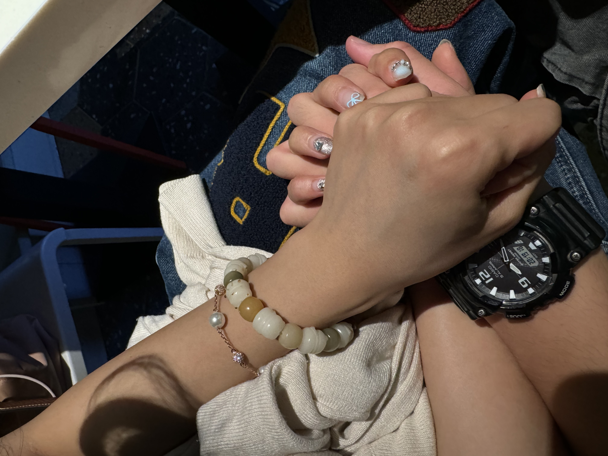
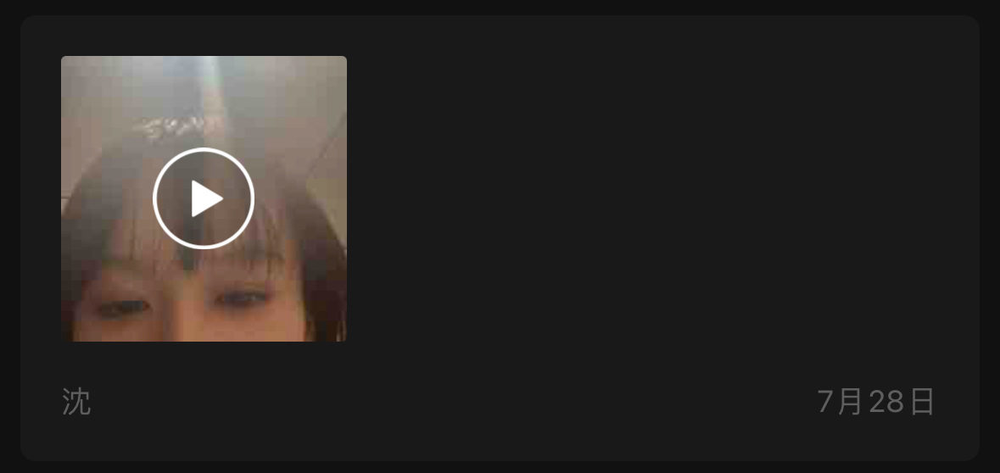
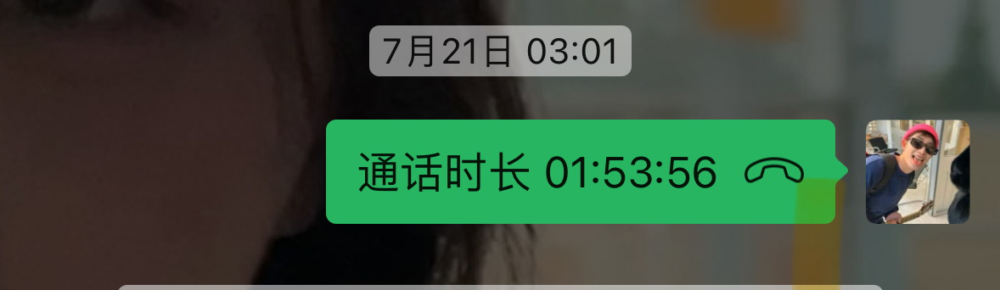
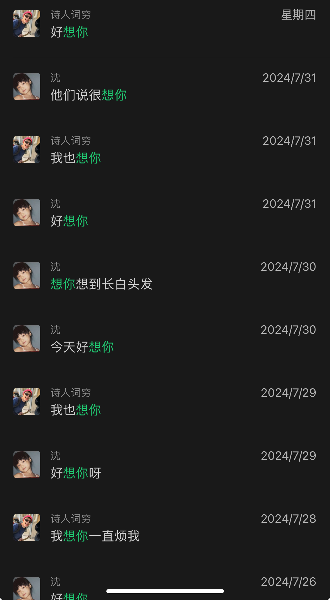
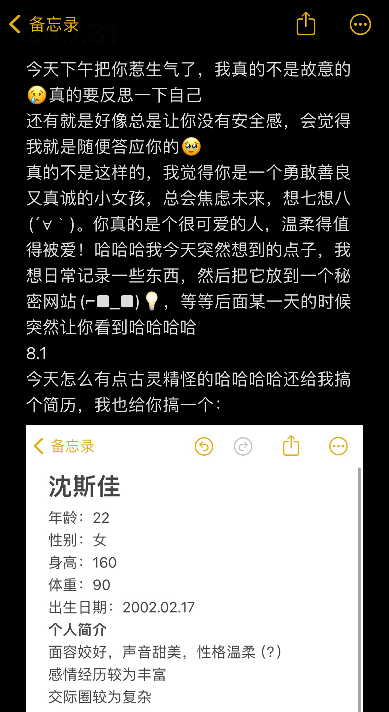

# 🌹 To My Dearest Sijia 🌹

##  引言💖

亲爱的斯佳，

马上七夕了，由于相隔甚远不方便亲自手写什么送到你手中，于是身为工科生的我穷尽一切想到了这个不知浪漫与否但是傻傻的想法：我想为刚刚在一起没多久的异地恋女友创建一个公开的github仓库。我希望通过这个小小的仓库，传达我对你的思念和爱意。每一张图片、每一段话语都是我对我们美好回忆的珍藏（原谅我这么有收藏癖）。不管怎样，你是非常可爱的人，真应该遇到最好的人，我也真希望我就是。

##  思念与感谢🌟

距离让我们更加珍惜彼此的存在。尽管无法时刻相伴，但你温暖的声音和甜美的笑容总是在我心中回荡。感谢你在这段时间里给予我的支持和陪伴，让我感受到无尽的温暖和鼓励。

##  特别回忆📸

### 我们的牵手

*这一刻，我知道我的世界因为有你而变得完整。*

### 收到过最好的offer
古灵精怪的你曾给我写过一封邮件，调皮地说着祝贺的话语，授予了我最佳男友的职位。邮件的内容放在[这里](messages/My_Best_Offer_in_life.pdf)，每次读到都忍不住笑起来。

### 日常的镜头
很难想象，这一次的开始是靠女生的主动来推动的。我是个慢热又胆怯的人，害怕失败更害怕失去。但是我想，既然我们两颗子弹真的碰撞在一起，我将永远也不会放手。

## 未来展望

虽然现在我们身处两地，但我相信，我们的心始终紧紧相连。未来的日子里，我们会一起经历更多的风雨和阳光，写下更多的美好回忆。这个仓库会随着我们的故事不断更新，我会用它记录我们的每一个特别时刻。

##  结语💌

谢谢你，亲爱的斯佳，让我感受到世界上最美好的爱情。期待我们再次相聚的那一天，让我亲手把这份爱传递给你。Again,但愿我和你是一支唱不完的歌。

永远爱你的，  
Zepu